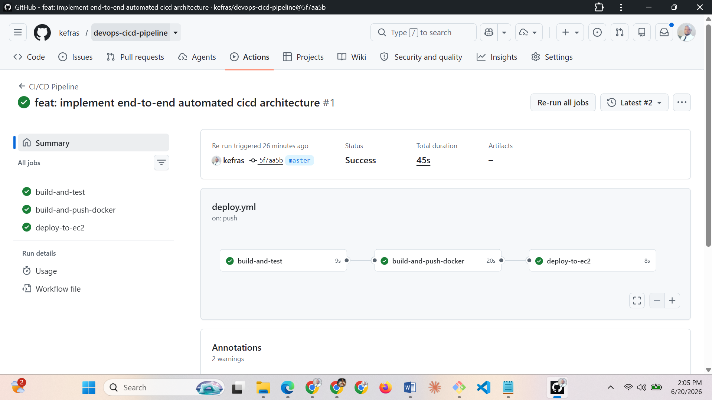

# devops-cicd-pipeline

A robust, automated Continuous Integration and Continuous Deployment (CI/CD) pipeline designed to streamline software delivery, ensure code quality, and automate deployments.

---

## 🚀 Project Overview

This repository contains the complete configuration, scripts, and infrastructure-as-code (IaC) necessary to build a fully automated CI/CD pipeline. The goal of this project is to minimize manual intervention, decrease deployment errors, and accelerate the release cycle.

### Repository Status
Below is a current view of the active repository structure:

<p align="center">
  
</p>



---

## 🛠️ Tools & Technologies Used

* **Version Control:** GitHub
* **CI/CD Automation:** *[e.g., GitHub Actions / Jenkins / GitLab CI]*
* **Containerization:** *[e.g., Docker]*
* **Orchestration / Hosting:** *[e.g., Kubernetes / AWS ECS / Vercel]*
* **Infrastructure as Code:** *[e.g., Terraform / Ansible]*
* **Security & Quality:** *[e.g., SonarQube / Snyk]*

---

## 📦 Features

* **Automated Testing:** Triggers unit and integration tests automatically on every pull request.
* **Linting & Code Quality:** Enforces formatting standards and scans for code smells before building.
* **Container Build & Push:** Packages the application into a Docker image and pushes it to a secure registry.
* **Automated Deployment:** Deploys seamlessly to staging/production environments upon successful main branch merges.
* **Slack/Email Notifications:** Keeps the team updated on build successes or failures.

---

## ⚙️ Getting Started

### Prerequisites
Before you begin, ensure you have the following installed and configured:
* Git
* Docker,
* AWS CLI]*

### Installation & Local Setup

1. **Clone the repository:**
```bash
   git clone [https://github.com/kefras/devops-cicd-pipeline.git](https://github.com/kefras/devops-cicd-pipeline.git)
   cd devops-cicd-pipeline
